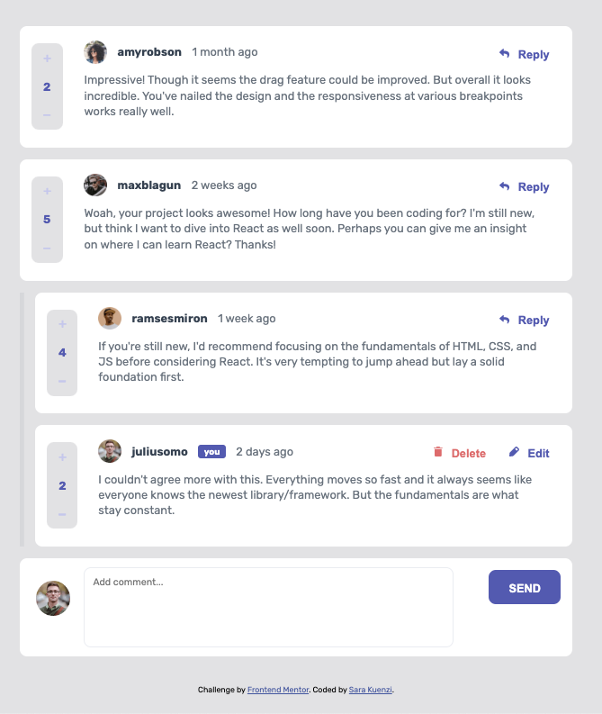
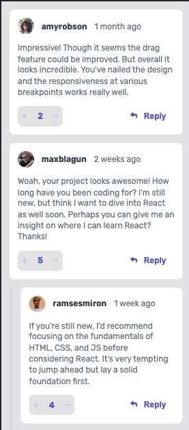
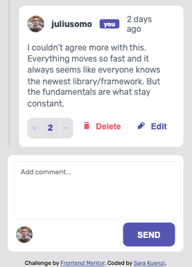

# Frontend Mentor - Interactive comments section solution

This is a solution to the [Interactive comments section challenge on Frontend Mentor](https://www.frontendmentor.io/challenges/interactive-comments-section-iG1RugEG9). Frontend Mentor challenges help you improve your coding skills by building realistic projects. 

## Table of contents

- [Overview](#overview)
  - [The challenge](#the-challenge)
  - [Screenshot](#screenshot)
  - [Links](#links)
- [My process](#my-process)
  - [Built with](#built-with)
  - [What I learned](#what-i-learned)
  - [Continued development](#continued-development)
  - [Useful resources](#useful-resources)
- [Author](#author)

## Overview

### The challenge

Users should be able to:

- View the optimal layout for the app depending on their device's screen size
- See hover states for all interactive elements on the page
- Create, Read, Update, and Delete comments and replies
- Upvote and downvote comments
- **Bonus**: If you're building a purely front-end project, use `localStorage` to save the current state in the browser that persists when the browser is refreshed.
- **Bonus**: Instead of using the `createdAt` strings from the `data.json` file, try using timestamps and dynamically track the time since the comment or reply was posted.

### Screenshot





### Links

- Solution URL: (https://github.com/skuenzi/interactive-comment-section)
- Live Site URL:(https://skuenzi.github.io/interactive-comment-section/)

## My process

### Built with

- Flexbox
- CSS Grid
- Mobile-first workflow
- [React](https://reactjs.org/) - JS library


### What I learned

I found this project really challenging because of the nested structure and my desire to keep the code DRY. I didn't like the idea of having separate components for the comments and replies when they were so similar. One of the first versions actually just used the mapped over the Comments component within itself to render the replies. But when it came to iterating through the comments and the replies for the actions, it actually become simpler to create a Reply component. 

I'm particularly proud of the code that limits the votes. I knew I wanted to prevent the user from changing the score by more than one point, but it was a bit of a challenge to disable the buttons after clicking while also making sure that it could be undone. 


```js
  const handleScoreChange = (e) => {
    if (e.target.classList.contains("minus-btn")) {
      setScore((prevScore) => prevScore - 1);
      if (score - starterScore < 1) {
        setDisableDownvote(true);
        setDisableUpvote(false);
        starterScore = props.score;
      }
    }
    if (e.target.classList.contains("plus-btn")) {
      setScore((prevScore) => prevScore + 1);
      if (starterScore - score < 1) {
        setDisableUpvote(true);
        setDisableDownvote(false);
        starterScore = props.score;
      }
    }
  };
```

### Continued development

There are several places that this code could be improved. I actually originally started learning Redux for this project, thinking that a state management library could make things easier. But in the end, it was simplest to just use React. I could see it being useful to go back and implement Redux to make the code a bit more efficient. I would also like to complete the bonus challenge of saving the data to localStorage. 

### Useful resources

- (https://www.youtube.com/watch?v=sjAeLwuezxo) - I used this tutorial to help with writing the logic for this project. It was a really good base to help me understand what needed to happen.


## Author

- Website - [Sara Kuenzi](skuenzi.github.io)
- Frontend Mentor - [@skuenzi](https://www.frontendmentor.io/profile/skuenzi)
